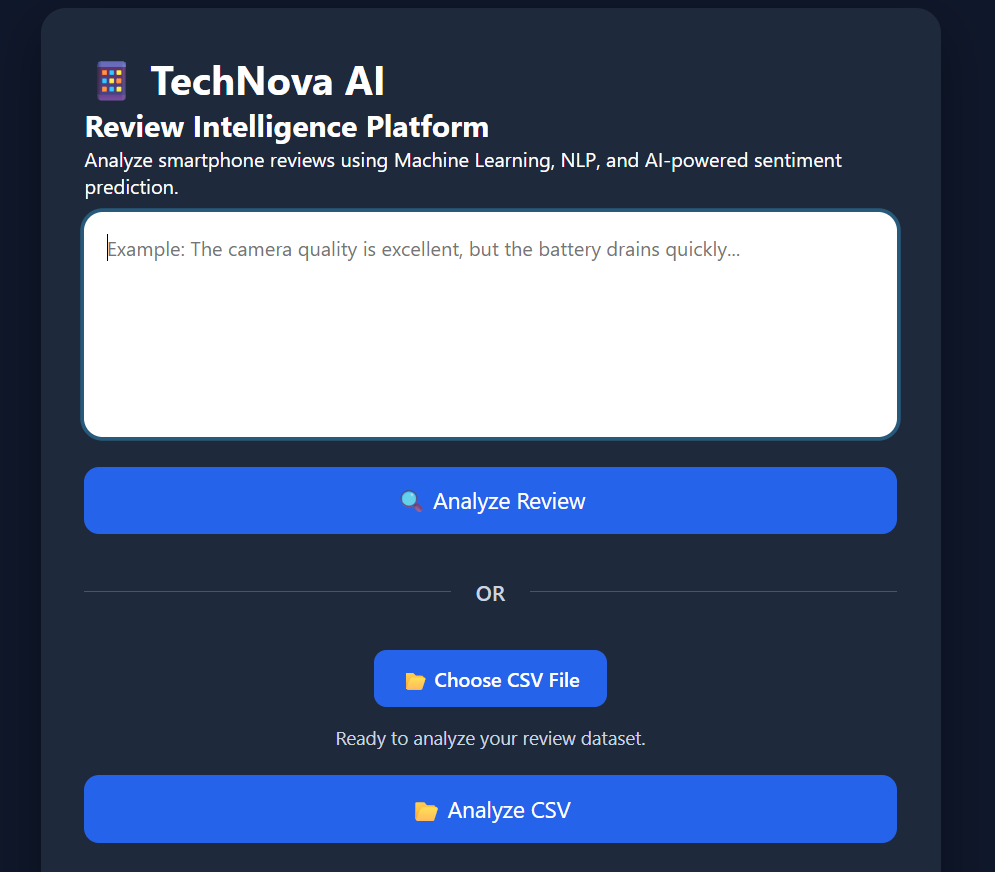
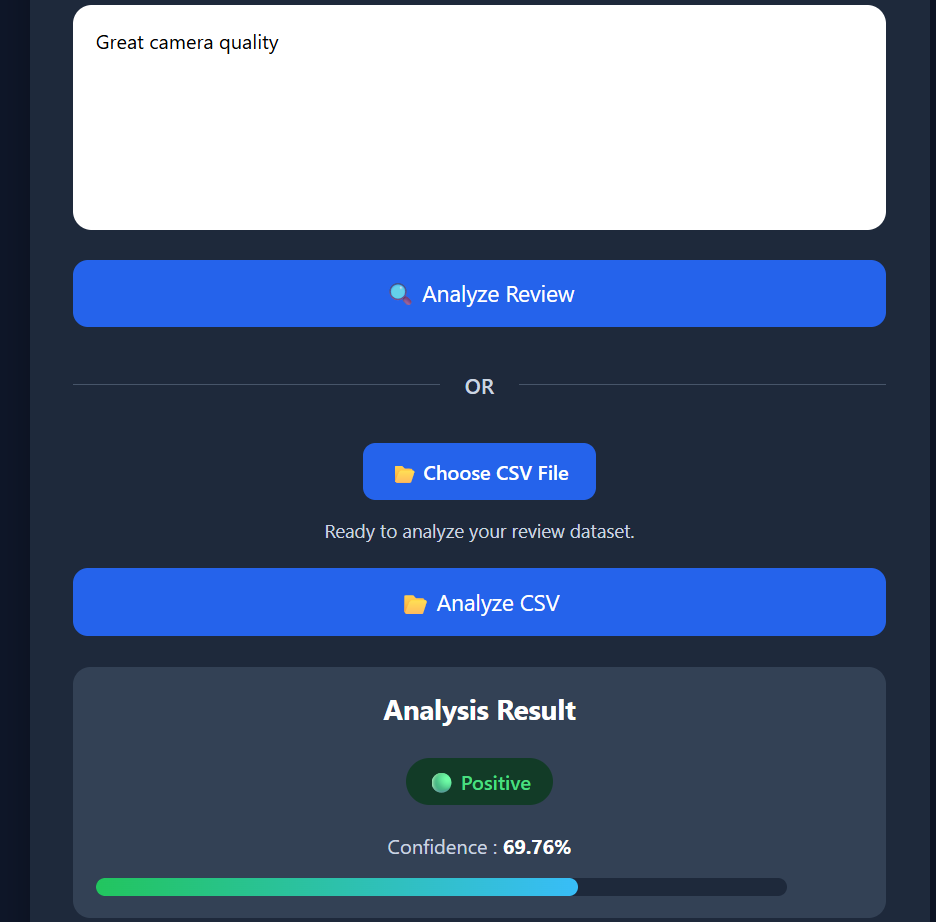
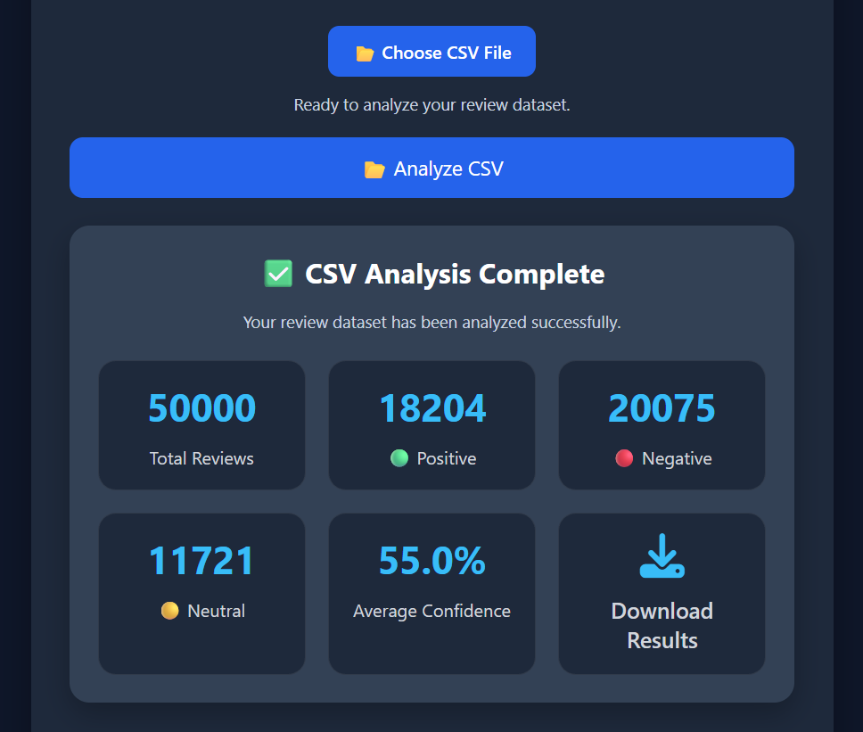
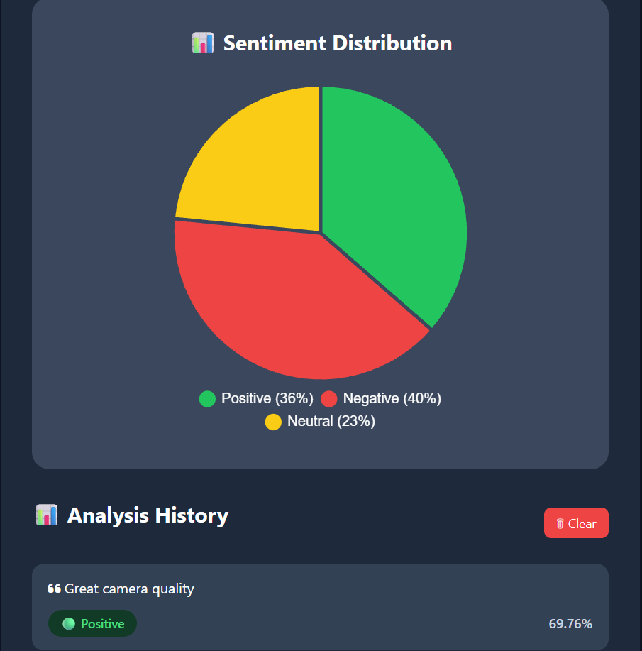

# 📱 TechNova AI – Review Intelligence Platform

A Machine Learning-powered web application that analyzes smartphone reviews using Natural Language Processing (NLP) and predicts customer sentiment with confidence scores.

## 🚀 Live Demo

🔗 https://technova-ai.onrender.com

---

## ✨ Features

- 🔍 Single Review Sentiment Analysis
- 📂 Bulk CSV Review Analysis
- 📊 Interactive Dashboard
- 🥧 Sentiment Distribution Pie Chart
- 📈 Confidence Score Prediction
- 📥 Download Analyzed CSV
- 📜 Prediction History
- 🌐 Fully Deployed on Render

---

## 🛠 Tech Stack

### Machine Learning
- Python
- Scikit-learn
- TF-IDF Vectorizer
- Logistic Regression

### Backend
- Flask

### Frontend
- HTML
- CSS
- JavaScript
- Chart.js

### Deployment
- GitHub
- Render

---

## 📸 Screenshots

(Add screenshots here)

---

## 📂 Project Structure

```
TechNova-AI-Review-Intelligence-Platform
│
├── static/
├── templates/
├── app.py
├── model.pkl
├── vectorizer.pkl
├── requirements.txt
├── Procfile
└── README.md
```

---

## ⚙️ Installation

Clone the repository

```bash
git clone https://github.com/aayush0296362/TechNova-AI-Review-Intelligence-Platform.git
```

Install dependencies

```bash
pip install -r requirements.txt
```

Run the application

```bash
python app.py
```

Open

```
http://127.0.0.1:5000
```

---

## 👨‍💻 Author

**Aayush **

GitHub:
https://github.com/aayush0296362

---

⭐ If you like this project, consider giving it a star!

## Screenshots








